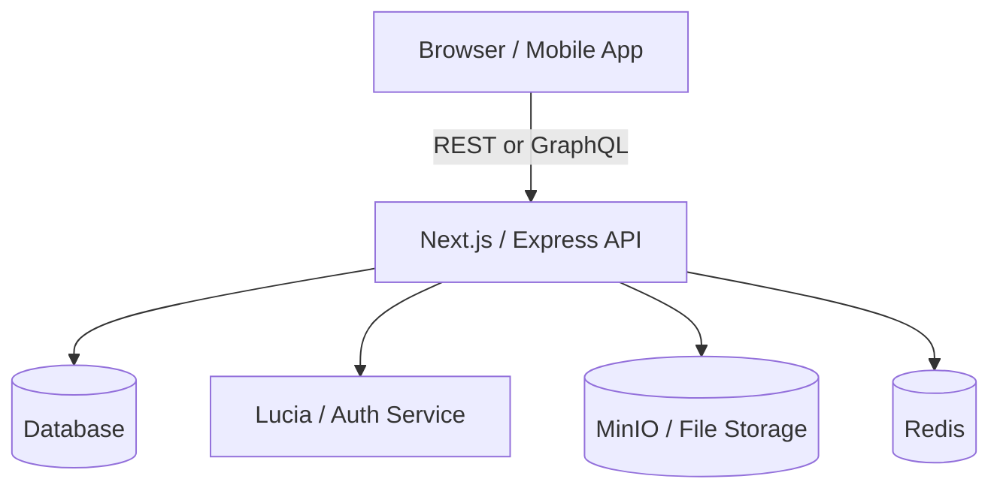

# SYSTEM ARCHITECTURE TEMPLATE

## 🔁 Context Reminder
This file serves as a **template and guide** for defining the architecture of your full stack application.  
Use it alongside `SRS.md` and `PRD.md`.

🎯 Always remind your AI assistant to:
> "Track token usage toward [YOUR TOKEN LIMIT], and notify me when we're close."

---

## 1. 🔍 Overview

- **System Type**: [Monolith / Microservices / Serverless / Hybrid]
- **Primary Use Case**: [What the app is for – e.g., content platform for creators]
- **Target Platform(s)**: [Web / Mobile / Desktop / API-only / etc.]

---

## 2. 🗺️ Architecture Diagram

Use diagrams or mermaid to describe system flow.

---

## 3. 🧱 Component Breakdown

| Component         | Responsibility / Purpose                             |
|------------------|-------------------------------------------------------|
| **Frontend**      | [Framework: Next.js / Vue / etc.] Handles UI, routing |
| **API Layer**     | [Backend framework: Express / Fastify / etc.] Business logic, validation |
| **Auth Service**  | [Lucia, Auth.js, Firebase Auth, etc.] Login, tokens   |
| **Database**      | [SQLite / PostgreSQL / MongoDB] Main data storage     |
| **File Storage**  | [MinIO / S3 / Cloudinary] Image/video uploads         |
| **Cache Layer**   | [Redis / Memcached] Speed up session or query data    |

---

## 4. 🔁 Key Workflows (Interaction Flows)

📥 **User Signup Flow**
1. User submits form on frontend
2. Request hits API
3. API validates and interacts with Auth system
4. Session is created and cached
5. JWT/token sent back to user

📤 **Data Fetch Flow**
1. Frontend calls API
2. Auth is checked via middleware
3. DB queried and formatted
4. JSON returned to client

(Repeat this structure for other key flows: uploads, voting, comments, etc.)

---

## 5. 🚀 Deployment Plan

- **Local Dev**: [e.g., Docker Compose, SQLite + MinIO]
- **Production Environment**: [Vercel, Railway, Fly.io, self-hosted]
- **CI/CD**: [GitHub Actions / Railway deploy hooks / etc.]
- **TLS Strategy**:
  - Dev: Self-signed
  - Prod: Certbot + auto-renew
  - UI: Admin dashboard toggle + reload

---

## 6. 📈 Scaling & Resilience

- Stateless APIs with token-based auth
- Redis for shared sessions
- Optional DB read replicas
- Use NGINX or API gateway for load balancing

---

## 7. 📊 Monitoring & Observability

| Layer          | Tool / Strategy                  |
|----------------|----------------------------------|
| Logs           | Pino + centralized via Loki      |
| Metrics        | Prometheus / Grafana             |
| Error Tracking | PostHog / Sentry / Console logging |
| Uptime         | Healthchecks / Fly.io status pages |

---

## 8. 🧩 Optional Integrations

- **PostHog** – Product analytics
- **OpenAPI** – Auto-generated API docs
- **Kubernetes** – Production orchestration
- **Webhooks / Queue** – For async processing

---

This architecture guide should evolve with your system.  
Each time you change your backend logic, add a new service, or swap deployment strategies—**update this doc.**
